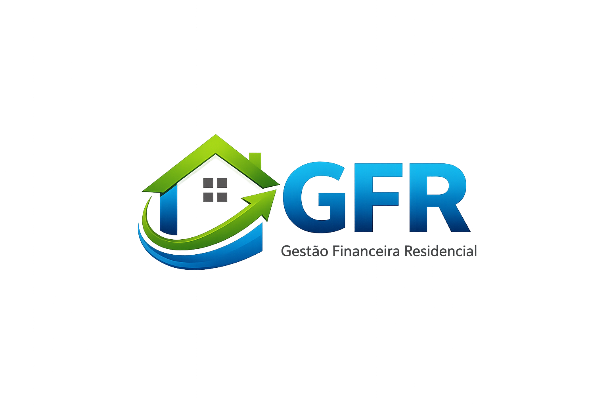

<!-- Adicione Badges das tecnologias que você usou aqui -->
<!-- Você pode encontrar badges aqui: https://github.com/Ileriayo/markdown-badges?tab=readme-ov-file#markdown-badges -->

**Este projeto está sendo desenvolvido com a finalidade de auxiliar no controle financeiro de uma residência.**

# Gestão Financeira Residencial(GFR)

<!-- Substitua a seguinte imagem por uma logo do seu projeto -->

<!-- Substitua o seguinte parágrafo por um resumo do seu projeto: -->
Sistema de controle de gastos residenciais, desenvolvido com .NET (Web API) e React com TypeScript, permitindo o gerenciamento de pessoas, categorias e transações financeiras, com cálculo de totais e saldo.

## Sobre o autor

<!-- Coloque seu nome, uma foto sua e uma pequena bio sobre você na seguinte tabela: -->
|  |  |
|:-------------:|:------------------------------------------------------------:|
|    **Anthony Famar** | Nasci em Cuiabá em 22 de junho de 2000. Atualmente, sou estudante de Ciência da Computação e faço estágio como desenvolvedor. Meus dias são preenchidos com estudos para me tornar um programador e tenho como hobby a emoção de andar de moto, sair com amigos e me dedicar à academia. Essa mistura de paixões é o que torna minha jornada única e envolvente. |
